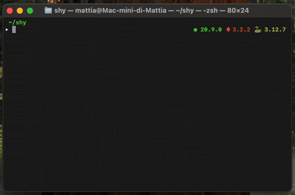
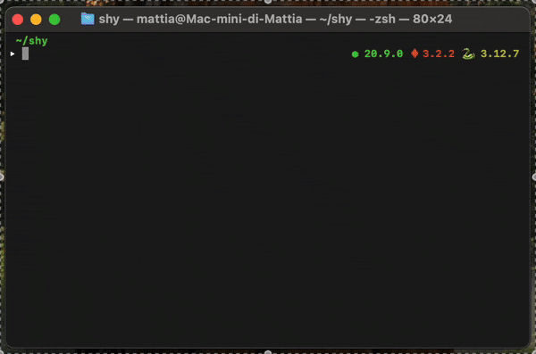
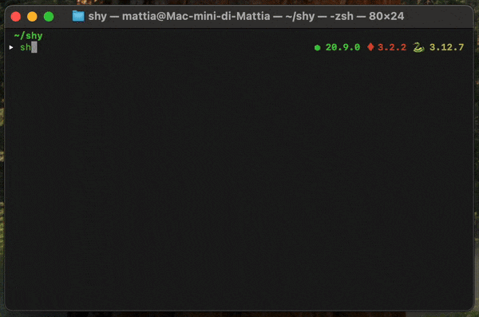

# Shy.sh

Sh shell AI copilot



## Install

```sh
pip install shy-sh
```

Configure your LLM

```sh
shy --configure
```

Supported providers: openai, anthropic, google, groq, aws, ollama

## Help

Usage: `shy [OPTIONS] [PROMPT]...`

Arguments
prompt [PROMPT]

Options

- -i Interactive mode [default false if a prompt is passed else true]
- -x Do not ask confirmation before executing scripts
- -e Explain the given shell command
- --configure Configure LLM
- --help Show this message and exit.

## Settings

```sh
shy --configure
 Provider: ollama
 Model: llama3.2
 Agent Pattern: react
 Temperature: 0.0
 Language: klingon
 Safe Mode: Yes
```

#### Configurable settings

- Provider: The LLM provider to use [OpenAI, Anthropic, Google, Groq, AWS Bedrock, Ollama(local)].
- API Key: The API key for the LLM provider. (Format for aws bedrock: `region_name acces_key secret_key`)
- Model: The LLM model to use.
- Agent Pattern: react or function_call. (If you are not using OpenAI, Anthropic or Google, react is recommended)
- Temperature: The LLM model's temperature setting.
- Language: The language for the LLM's final answers.
- Safe Mode: When enabled, no commands or scripts will be executed on your system; you will only receive suggestions. This feature is recommended for beginners.

All the settings are saved in `~/.config/shy/config.yml`

## Examples

```sh
> shy find all python files in this folder

🛠️ find . -type f -name '*.py'

Do you want to execute this command? [Yes/no/copy/explain/alternatives]:

./src/chat_models.py
./src/agent/tools.py
./src/agent/__init__.py
./src/agent/agent.py
./src/settings.py
./src/main.py

🤖: Here are all the Python files found in the current folder and its subfolders.
```

```sh
> shy -x convert aaa.png to jpeg and resize to 200x200

🛠️ convert aaa.png -resize 200x200 aaa.jpg

🤖: I converted the file aaa.png to JPEG format and resized it to 200x200 pixels.
```

```sh
> shy resize movie.avi to 1024x768 and save it in mp4

🛠️ ffmpeg -i movie.avi -vf scale=1024:768 -c:v libx264 output.mp4

Do you want to execute this command? [Yes/no/copy/explain/alternatives]: c

🤖: Command copied to the clipboard!
```

```sh
> shy

✨: Hello, how are you?

🤖: Hello! I'm fine thanks

✨: how many files in this folder

🛠️ ls | wc -l

Do you want to execute this command? [Yes/no/copy/explain/alternatives]:

5

✨: exit

🤖: 👋 Bye!
```

```sh
> shy -e "find . -type f -name '*.py' | wc -l"

🤖: This shell command uses `find` to search for files (`-type f`) with the extension `.py` (`-name '*.py'`) in the current directory (`.`) and its subdirectories.
The results are then piped to `wc -l`, which counts the number of line.
In conclusion, the command presents the total count of Python files (*.py) located within the current directory and its subdirectories.
```





## Privacy

If you are not using Ollama as provider, please note that information such as the current path, your operating system name, and the last commands executed in the shell may be included in the LLM context.
